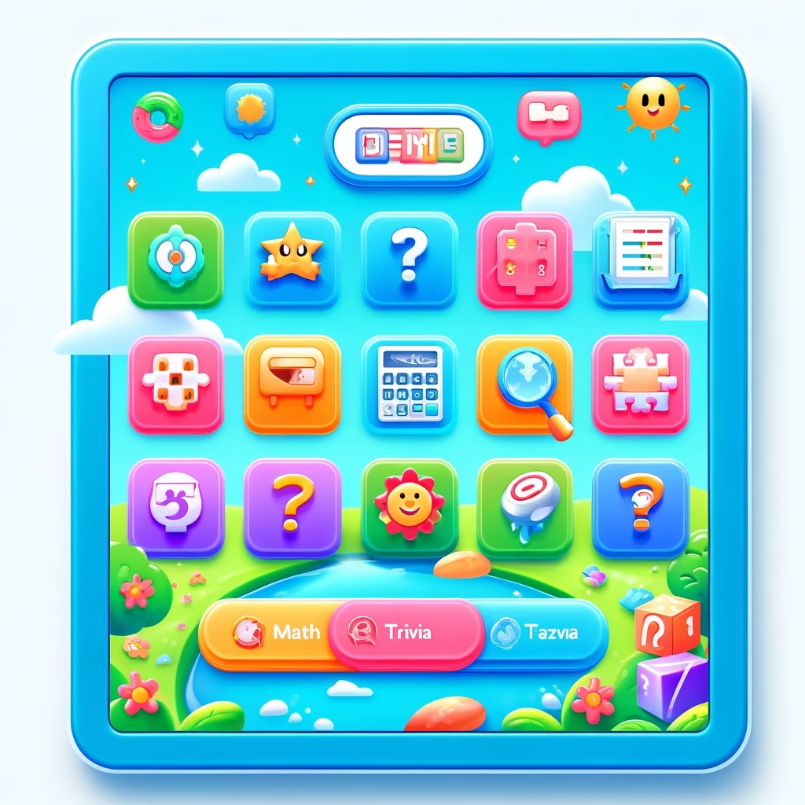

# Brain Bounce
 Brain Bounce is an exciting educational app that makes learning a blast for kids! 
 With a colorful and friendly interface, this app offers a variety of fun quizzes and 
 games that cover essential subjects like math, vocabulary, and science. Designed 
 specifically for children in grades 2 to 4, Brain Bounce encourages young learners to 
 explore new concepts and practice their skills in an interactive environment. Each 
 game is crafted to be engaging and educational, ensuring that every session is both 
 rewarding and entertaining. Whether solving puzzles, answering trivia, or conquering 
 challenges, Brain Bounce keeps young minds engaged and eager to learn more each day!
 

As a programmer you need to create a program that let's 2nd graders to play
games.  
Start of the game should prompt a welcome message:
> "Welcome to a Brain Bounce"
  "This is an interactive gave where you can practice math or play a trivia game"
 "Please choose a game type:"
  1. Math
  2. Trivia
  3. End the program

 
Student will choose one of the above option. If Math is chosen, then your program should
display math question:

> What is 5 + 3?

Then student will have to give an answer:
> Your answer: 7

>Wrong answer, please try again or enter 0 to skip the question

Program should keep asking until either student give a correct anwer or enters 0

If student chooses Trivia then question should be displayed in a following format:

> What color are strawberries? 
> 1. Red 
> 2. Blue
> 3. Green

Then student will choose an option.

> Answer: 2

If student chooses a wrong answer it should display:

> You chose Blue, it's incorrect. Please try again or enter 0 to skip the question

Program should keep asking if answer is incorrect until correct answer is selected
or student enters 0.

### Suggested Steps to create the program

1. Create a class Game
2. Create a method that will read data from the files under "files" package.
3. Create a method that will split question from the answer using "|" in the text. For math questions
there is only 1 correct answer. For Trivia questions there are 3 answers. First one is always
the correct one. It's up to you how to differentiate them and how to store them. You 
can use any data structures. (Recommended ones are maps and arrayLists)
4. Make sure you store math questions and trivia questions in separate places
5. By using a Scanner class in Player class prompt all necessary questions and capture user answers.
6. Use loops and conditionals
7. Bonus: give 1 point for each correctly answered question with a first try
and store it. When program ends display the total points student got.
8. Work together, split the work, design the program together.